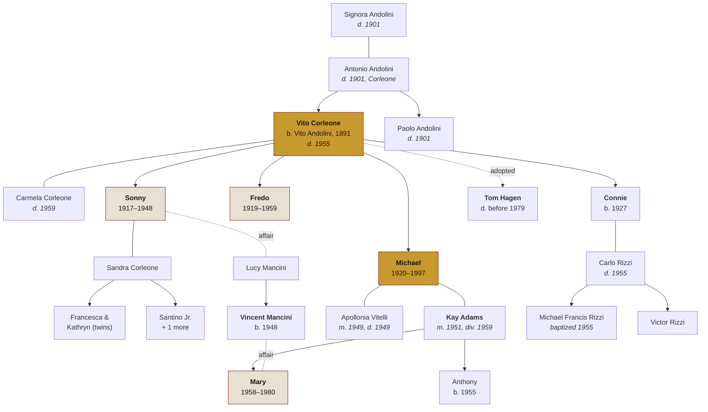
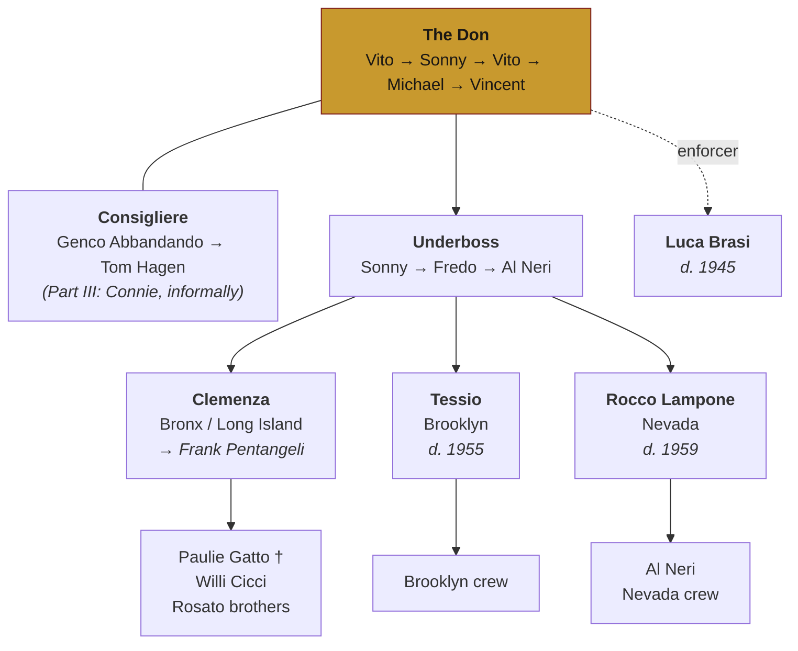

# The Family Tree

The Corleone family across four generations, plus the organization that surrounds it.

---

## The bloodline

*Dates are approximate and reconstructed from the films; the novel and the continuation novels sometimes disagree. See [Timeline](../data/timeline.md).*

---

## Reading it

**The solid lines** are blood or marriage. **The dotted line to Tom Hagen** is the whole point of Tom Hagen: he is raised as a son, functions as the most trusted man in the organization, and is never once considered for the succession, because he isn't Sicilian.

**The dotted line between Vincent and Mary** is *Part III*'s most uncomfortable thread — first cousins, and the affair Michael ends as the price of handing over the family.

**Vito's own line ends at nine years old.** Everything above him on the tree was killed in the space of a week in 1901, and the surname he carries is a clerical error made at Ellis Island by a man writing down the name of a town.

---

## The succession

| Don | Period | How it ended |
| --- | --- | --- |
| [Vito Corleone](vito-corleone.md) | 1920s–1945 | Shot; survived; semi-retired |
| [Sonny Corleone](sonny-corleone.md) | 1945–1948 *(acting)* | Murdered at a tollbooth |
| Vito Corleone | 1948–1955 | Retired to the garden; died there |
| [Michael Corleone](michael-corleone.md) | 1955–1980 | Abdicated after Mary's death |
| [Vincent Corleone](vincent-mancini.md) | 1980– | *(Unrecorded — no fourth film)* |

Note what the table hides: Michael is Don for twenty-five years, and the films show us four of them.

---

## The organization

**Consigliere** is the counselor — not in the chain of command, reports only to the Don. **Underboss** is second in command. **Caporegime** ("capo") runs a crew of soldiers in a territory. Terms are defined on the [Glossary](../reference/glossary.md).

---

## The Five Families of New York

| Family | Boss | Territory / business | Fate |
| --- | --- | --- | --- |
| **Corleone** | Vito → Michael | Olive oil, gambling, unions, politicians | Moves to Nevada, 1955 |
| **Tattaglia** | Philip Tattaglia | Prostitution, narcotics | Boss killed 1955 |
| **Barzini** | [Emilio Barzini](barzini-and-the-five-families.md) | The most powerful; backed Sollozzo | Boss killed 1955 |
| **Cuneo** | Carmine Cuneo | Milk / trucking, upstate | Boss killed 1955 |
| **Stracci** | Victor Stracci | New Jersey, gambling | Boss killed 1955 |

Plus the out-of-town powers: **Hyman Roth** (Miami/Havana), **Moe Greene** (Las Vegas), the **Rosato brothers** (Bronx, under Roth), and in *Part III* **Joey Zasa** and **Don Altobello**.

Full detail: [Barzini & the Five Families](barzini-and-the-five-families.md).

---

## The continuation novels

Winegardner and Falco add relatives the films don't:

- **Francesca Corleone** — Sonny's daughter, a major viewpoint character in [*The Godfather Returns*](../books/the-godfather-returns-2004.md)
- **Sandra Corleone** — Sonny's widow, given far more presence
- **Nick Geraci** — not family, but the most consequential invented character in the sequence
- A child of Fredo's, revealed in the last pages of [*The Godfather's Revenge*](../books/the-godfathers-revenge-2006.md)

None of these appear in any film. See [Continuity](../continuity.md#tier-4-the-continuation-novels).

---

## See also

- [Character index](index.md) · [Timeline](../data/timeline.md) · [Body Count](../data/body-count.md)
- [Glossary](../reference/glossary.md) — what a consigliere actually does
